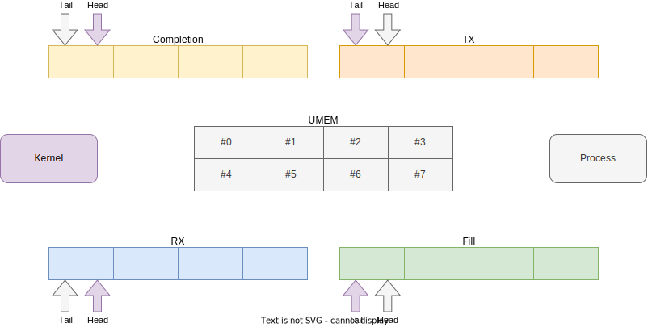
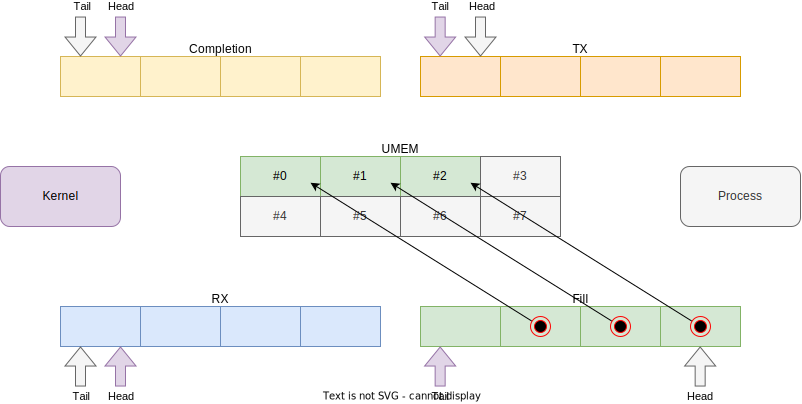
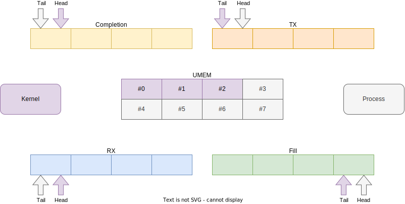
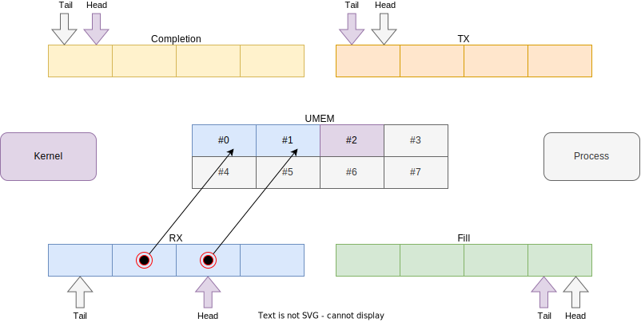
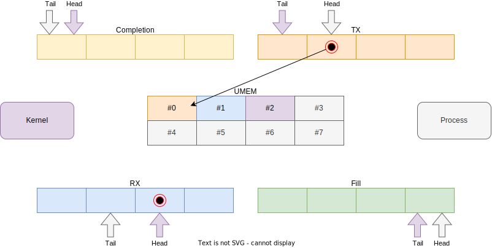
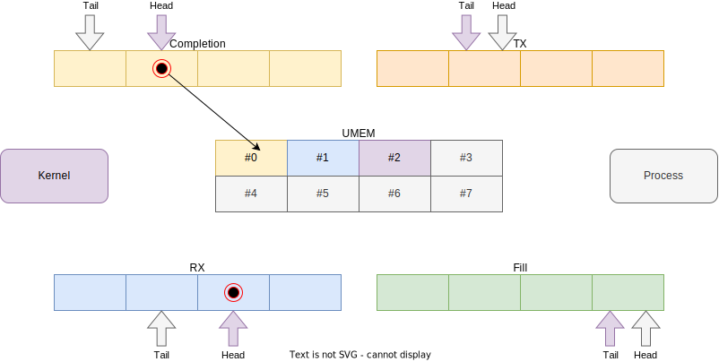
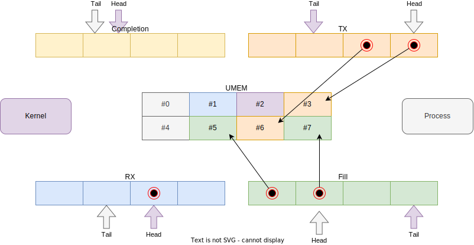

# AF_XDP

内核允许进程在快速数据路径（AF_XDP）地址族下创建套接字。这是一种特殊的套接字类型，与 XDP 程序结合使用可以执行完全或部分的内核绕过。在某些用例中，绕过内核网络栈可以提高性能。在 AF_XDP 地址族下创建的套接字也被称为 XSK（XDP Socket）。

此类用例的示例包括：

* 自定义协议实现：如果内核不理解自定义协议，它将执行许多不必要的工作，绕过内核并将流量交给正确处理它的进程可以避免开销。
* DDoS 保护：如果需要对多个数据包进行复杂处理，eBPF 程序可能跟不上，因此可能需要将流量转发到用户空间进行分析。
* 应用程序特定的优化：Linux 网络栈需要处理许多协议和边缘情况，这些情况不适用于您正在运行的工作负载。这意味着为不使用的付费功能支付性能成本。虽然不容易，但可以针对他们的需求实现自定义网络栈，以榨取每一滴性能。

所有入口流量首先由 XDP 程序处理，它可以决定哪些流量传递给栈，哪些绕过。这非常强大，因为它允许用户绕过特定应用程序、端口和/或协议的流量，而不会破坏正常的数据包处理。与其他内核绕过技术（如 `PACKET_MMAP` 或 `PF_RING` ）不同，后者要求您处理所有流量并重新实现主机正常工作所需的每个协议。

## 使用方法

本页的其余部分将详细介绍此功能在内核级别的工作原理。大多数用户可能希望使用像 [libxdp](https://github.com/xdp-project/xdp-tools/tree/master/lib/libxdp#using-af_xdp-sockets) 这样的库，它实现了大部分困难的细节。示例程序可以在[这里](https://github.com/xdp-project/bpf-examples/tree/master/AF_XDP-example)找到。

!!! 警告
    AF_XDP 需要在普通 XDP 支持之上提供额外的驱动程序支持。请检查[驱动程序支持](https://ebpf-docs.dylanreimerink.nl/linux/program-type/BPF_PROG_TYPE_XDP/#driver-support)表以获取驱动程序兼容性。

## 工作原理

XSK（XDP Socket）是由几个“部分”组成，它们共同工作，必须以正确的方式设置和链接，以获得一个工作的 XSK。



套接字（未显示）将所有内容绑定在一起，为进程提供了一个文件描述符，该文件描述符用于系统调用。接下来是 “UMEM”，这是进程分配的一块内存，用于实际的数据包数据。它包含多个块，因此它的工作方式非常像一个数组。最后是 4 个环形缓冲区：`RX`、`TX`、`FILL` 和 `COMPLETION`。这些环形缓冲区用于传达不同 UMEM 块的所有权和意图。有关这方面的更多细节，请参见[接收和发送数据包](#接收和发送数据包)部分。

### 设置XSK

第一步是创建套接字，我们将把 UMEM 和环形缓冲区附加到这个套接字上。我们通过调用 `socket` 系统调用来实现：

```c
fd = socket(AF_XDP, SOCK_RAW, 0);
```

接下来是设置和注册 UMEM。有两个参数需要考虑：

* 第一个参数是**块的大小**，这决定了我们可以适应的最大数据包大小。这必须是在 `2048` 和系统页面大小之间并且是 2 的幂值。对于大多数系统来说，选择在 `2048` 和 `4096` 之间。
* 第二个参数是**块的数量**，这可以根据需要进行调整，但一个不错的默认值似乎是 `4096`。假设块大小为 `4096`，这意味着我们应该分配 `16777216` 字节（16 MiB）的内存。

```c
static const int chunk_size = 4096;
static const int chunk_count = 4096;
static const int umem_len = chunk_size * chunk_count;
unsigned char[chunk_count][chunk_size] umem = malloc(umem_len);
```

现在我们有了 UMEM，通过 `setsockopt` 系统调用来将其链接到套接字：

```c
struct xdp_umem_reg {
    __u64 addr; /* 数据包数据区域的开始 */
    __u64 len; /* 数据包数据区域的长度 */
    __u32 chunk_size;
    __u32 headroom;
    __u32 flags;
};

struct xdp_umem_reg umem_reg = {
    .addr = (__u64)(void *)umem,
    .len = umem_len,
    .chunk_size = chunk_size,
    .headroom = 0, // 参见选项、变体和例外
    .flags = 0, // 参见选项、变体和例外
};
if (!setsockopt(fd, SOL_XDP, XDP_UMEM_REG, &umem_reg, sizeof(xdp_umem_reg)))
    // 处理错误
```

接下来是环形缓冲区。当通过 `setsockopt` 系统调用来告诉内核我们希望每个环形缓冲区有多大时，它们由内核分配。分配后，我们可以通过 `mmap` 系统调用来将环形缓冲区映射到我们进程的内存中。

以下过程应该对每个环形缓冲区重复执行（使用不同的选项）：

我们需要确定所需的环形缓冲区大小，必须是 2 的幂值，例如 `128`、`256`、`512`、`1024` 等。环形缓冲区的大小可以根据需要进行调整，并且可以不同，我们在这个例子中选择 `512`。

我们通过 `setsockopt` 系统调用来通知内核我们选择的大小：

```c
static const int ring_size = 512;
if (!setsockopt(fd, SOL_XDP, {XDP_RX_RING,XDP_TX_RING,XDP_UMEM_FILL_RING,XDP_UMEM_COMPLETION_RING}, &ring_size, sizeof(ring_size)))
    // 处理错误
```

设置完所有环形缓冲区的大小后，我们可以通过 `getsockopt` 系统调用来请求 `mmap` 偏移量：

```c
struct xdp_ring_offset {
    __u64 producer;
    __u64 consumer;
    __u64 desc;
    __u64 flags;
};

struct xdp_mmap_offsets {
    struct xdp_ring_offset rx;
    struct xdp_ring_offset tx;
    struct xdp_ring_offset fr; /* Fill */
    struct xdp_ring_offset cr; /* Completion */
};

struct xdp_ring_offset offsets = {0};

if (!getsockopt(fd, SOL_XDP, XDP_MMAP_OFFSETS, &offsets, sizeof(xdp_ring_offset)))
    // 处理错误
```

最后一步是通过 `mmap` 系统调用来将环形缓冲区映射到进程内存：

```c
struct xdp_desc {
    __u64 addr;
    __u32 len;
    __u32 options;
};

void *{rx,tx,fill,completion}_ring_mmap = mmap(
    fd, 
    {XDP_PGOFF_RX_RING,XDP_PGOFF_TX_RING,XDP_UMEM_PGOFF_FILL_RING,XDP_UMEM_PGOFF_COMPLETION_RING},
    offsets.{rx,tx,fr,cr}.desc + ring_size * sizeof(struct xdp_desc),
    PROT_READ|PROT_WRITE,
    MAP_SHARED|MAP_POPULATE);
if (!{rx,tx,fill,completion}_ring_mmap)
    // 处理错误

__u32 *{rx,tx,fill,completion}_ring_consumer = {rx,tx,fill,completion}_ring_mmap + offsets.{rx,tx,fr,cr}.consumer;
__u32 *{rx,tx,fill,completion}_ring_producer = {rx,tx,fill,completion}_ring_mmap + offsets.{rx,tx,fr,cr}.producer;
struct xdp_desc[ring_size] {rx,tx,fill,completion}_ring = {rx,tx,fill,completion}_ring_mmap + offsets.{rx,tx,fr,cr}.desc;
```

我们已经设置了 XSK，并且我们可以访问 UMEM 和所有 4 个环形缓冲区。最后一步是将我们的 XSK 与网络设备和队列关联。

```c
struct sockaddr_xdp {
    __u16 sxdp_family;
    __u16 sxdp_flags;
    __u32 sxdp_ifindex;
    __u32 sxdp_queue_id;
    __u32 sxdp_shared_umem_fd;
};

struct sockaddr_xdp sockaddr = {
    .sxdp_family = AF_XDP,
    .sxdp_flags = 0, // 参见选项、变体和例外
    .sxdp_ifindex = some_ifindex, // 实际的ifindex是动态确定的，选择由用户决定。
    .sxdp_queue_id = 0,
    .sxdp_shared_umem_fd = fd, // 参见选项、变体和例外
};

if(!bind(fd, &sock
addr, sizeof(struct sockaddr_xdp)))
    // 处理错误
```

一个 XSK 只能绑定到 NIC 上的一个队列。对于多队列 NIC，应该为每个队列重复创建 XSK 的过程。UMEM 可以选择共享以节省内存使用，详细信息见[选项、变体和例外](#选项变体和例外)部分。

此时我们已经准备好发送流量，见[接收和发送数据包](#接收和发送数据包)。但我们仍然需要设置我们的 XDP 程序和 `XSKMAP` 以便绕过传入的流量。

### eBPF程序和映射

要实际开始绕过入口流量，我们需要一个 XDP 程序和一个 `BPF_MAP_TYPE_XSKMAP` 映射。该映射是一个以数字键开头的数组类型，从 0 开始向上。进程应该使用在[设置XSK](#设置XSK)部分中获得的 XSK 的文件描述符来填充映射的值。默认情况下，映射的键应与 XSK 附加的队列匹配。

例如，如果我们处理的是一个有 4 个队列的 NIC，那么映射的大小至少应该是 4，绑定到队列 `#2` 的 XSK 的文件描述符应该分配给映射中的键 `2`。如果队列 ID 不匹配，数据包将在运行时被丢弃。（除非使用共享 UMEM，见[选项、变体和例外](#选项变体和例外)）。

你的 XDP 程序可以根据您的用例需要简单或复杂。实际的绕过是通过 `bpf_redirect_map` 帮助函数完成的。

这是一个重定向绕过流量的示例：

```c
struct {
    __uint(type, BPF_MAP_TYPE_XSKMAP);
    __type(key, __u32);
    __type(value, __u32);
    __uint(max_entries, 64);
} xsks_map SEC(".maps");

SEC("xdp")
int xsk_redir_prog(struct xdp_md *ctx)
{
    __u32 index = ctx->rx_queue_index;

    if (bpf_map_lookup_elem(&xsks_map, &index))
        return bpf_redirect_map(&xsks_map, index, XDP_PASS);
    return XDP_PASS;
}
```

!!! 注意
    默认情况下，给 `bpf_redirect_map` 的索引必须等于数据包接收到的 NIC 的队列 ID，由 `rx_queue_index` 指示。使用共享 UMEM 的例外。

下面的例子有点复杂，但演示了只绕过非常特定流量的能力，在这个例子中 UDP 端口 `9091`。

```c
struct {
    __uint(type, BPF_MAP_TYPE_XSKMAP);
    __uint(max_entries, 256);
    __type(key, __u32);
    __type(value, __u32);
} xsk SEC(".maps");

SEC("xdp")
int rx(struct xdp_md *ctx)
{
    void *data, *data_meta, *data_end;
    struct ipv6hdr *ip6h = NULL;
    struct ethhdr *eth = NULL;
    struct udphdr *udp = NULL;
    struct iphdr *iph = NULL;
    struct xdp_meta *meta;
    int ret;

    data = (void *)(long)ctx->data;
    data_end = (void *)(long)ctx->data_end;
    eth = data;
    if (eth + 1 < data_end) {
        if (eth->h_proto == bpf_htons(ETH_P_IP)) {
            iph = (void *)(eth + 1);
            if (iph + 1 < data_end && iph->protocol == IPPROTO_UDP)
                udp = (void *)(iph + 1);
        }
        if (eth->h_proto == bpf_htons(ETH_P_IPV6)) {
            ip6h = (void *)(eth + 1);
            if (ip6h + 1 < data_end && ip6h->nexthdr == IPPROTO_UDP)
                udp = (void *)(ip6h + 1);
        }
        if (udp && udp + 1 > data_end)
            udp = NULL;
    }

    if (!udp)
        return XDP_PASS;

    if (udp->dest != bpf_htons(9091))
        return XDP_PASS;

    return bpf_redirect_map(&xsk, ctx->rx_queue_index, XDP_PASS);
}
```

### 接收和发送数据包

完成所有上述设置工作后，我们可以开始接收和发送流量。本节中的所有代码都发生在进程中。

在创建 XSK 后，我们的状态如下所示。


在上面的图表中，您可以看到我们的 UMEM 部分，4 个环形缓冲区，内核和我们的进程。UMEM 块的颜色编码表示“所有权”。

环形缓冲区用于进程和内核之间的通信。如果操作正确，它允许使用相同的预先分配的内存块进行双向数据流，无需使用自旋锁或其他同步技术。

环形缓冲区是单生产者，单消费者的。环由实际的描述符数组（`#!c struct xdp_desc`）、`生产者`和`消费者`组成。在我们的图表中，我们把`生产者`称为`head`，把`消费者`称为`tail`，因为这些是队列/环形缓冲区中使用的更典型的术语。

内核更新 `RX` 和 `COMPLETION` 缓冲区的`生产者`/`head`，进程更新 `TX` 和 `FILL` 缓冲区的`生产者`/`head`。消费者监视`生产者`/`head`的变化，如果更新了，可以安全地读取`tail`/`消费者`和`生产者`/`head`之间的 UMEM 块。消费者增加`tail`/`消费者`以向生产者表示环形缓冲区上的位置可以重用。环形缓冲区中的描述符包含一个 `addr` 字段，它是 UMEM 中的偏移量，表示块，一个 `len` 字段，表示块中的任何数据的长度，以及一个 `flags` 字段。

当我们开始时，所有的块都由进程拥有，这意味着它可以安全地读写，不必担心竞争条件。

* `FILL` 环形缓冲区用于向内核提供块。内核将用数据包数据填充这些块。
* `RX` 环形缓冲区用于向进程提供入口数据包数据。
* `TX` 环形缓冲区用于发送数据包。NIC 将传输指示的 UMEM 中的数据。这使用绑定到 NIC 上的 TX 队列来完成。
* `COMPLETION` 环形缓冲区用于内核在传输后将 UMEM 块返回给进程。

有了所有这些知识，让我们通过一个理论示例来演示。在这个示例中，我们实现了一个简单的 UDP 服务器，响应传入的流量。

我们首先通过更新 `FILL` 队列中的描述符并增加`生产者`/`head`指针来给内核一些块。



这很重要，因为如果进程没有提供块，内核将被迫丢弃数据包。实际上，最好将大部分块交给内核，除非您有一个写入密集型应用程序。

内核将“消费”队列中的消息并拥有 UMEM 块。它增加了`消费者`/`tail`指针。



内核将保留这些块并将数据包数据写入其中。在数据包完全接收后，内核将在 `RX` 缓冲区更新描述符，设置 `addr` 和 `len` 字段。然后增加`生产者`/`head`指针。



我们的进程需要监视 `RX` 缓冲区的`生产者`/`head`，以知道何时可以读取 UMEM。进程可以忙轮询或使用 `poll/epoll` 机制阻塞/休眠，直到缓冲区更新。

更新后，我们的进程应该增加`消费者`/`tail`指针并处理数据包。在这一点上，包含数据的 UMEM 块由进程拥有，因此它既可以读取也可以写入。

此时，我们可以做几件事：

* 我们可以保留块。如果您的用例需要发送数据包而不需要响应（不是严格的请求-响应协议），可能需要缓冲一些块以进行发送。
* 我们可以通过 `FILL` 缓冲区将块返回。可选地复制内容以进行异步处理或在返回块之前处理。
* 我们可以修改块将其变成回复，并通过添加到 `TX` 缓冲区进行传输。

我们的示例进程巧妙地利用了这一点，通过修改一些字段，重新计算哈希并调整大小。然后它更新了 `TX` 缓冲区中的描述符并增加了`生产者`/`head`。



内核将看到待处理的数据包，消费 `TX` 缓冲区，并在 NIC 上发送数据包。然后它将块返回到 `COMPLETION` 缓冲区。



到目前为止，我们一直整齐地使用最上面的块，但应该注意，任何块都可以以任何顺序在任何时候使用。进程应该使用其他数据结构来跟踪块的所有权，并实现算法来维护块的所需平衡，针对用例进行优化。



### 选项、变体和例外

到目前为止，我们一直在看一个适合大多数情况的典型示例。然而，有一些选项我们可以改变以改变行为。

#### (零)拷贝模式

数据在 NIC 和 UMEM 之间传输的过程可以以拷贝或零拷贝模式工作。在零拷贝模式下，NIC 可以直接通过 DMA 访问 UMEM。由于 NIC 和进程都在同一内存上工作，不会发生内存拷贝，这对性能非常好。这需要驱动程序和 NIC 支持。对于不支持零拷贝模式的 NIC 和/或驱动程序，内核退回到拷贝模式，其中驱动程序/内核将在 NIC 和 UMEM 之间来回复制内存。

您可以通过在执行 `bind` 系统调用时指定 `XDP_COPY` 或 `XDP_ZEROCOPY` 标志来请求显式模式。如果请求了零拷贝模式但不可用，`bind` 系统调用将导致错误。

此外，绑定的套接字可以通过 `getsockopt` 和 `XDP_OPTIONS` 选项以及 `struct xdp_options` 值进行查询。如果设置了标志 `XDP_OPTIONS_ZEROCOPY`，则套接字以零拷贝模式运行。

#### 头部空间

在本文前面的设置部分，我们使用头部空间为 `0` 创建了 XSK。头部空间是 `struct xdp_umem_reg` 中的一个字段。如果不是 `0`，内核将把数据包的开始在 UMEM 块内向右移动。环形描述符中的 `addr` 仍然指示数据包的开始，但不再是块对齐的。

在期望封装接收到的数据包并再次传输的情况下，这是可取的。进程可以只写入头部空间中的封装头，并相应地调整 `TX` 环形缓冲区描述符中的 `addr` 和 `len`。如果头部空间没有使用，进程将被迫通过 `x` 字节复制整个数据包以适应头部，因此使用头部空间是一个重要的优化。

#### `TX`或`RX-only`套接字

如果您的用例只需要发送或接收，可能值得不实例化一些环形缓冲区。您可以通过只创建 `TX` 和 `COMPLETION` 环形缓冲区来创建仅 `TX` 的套接字，或者通过只创建 `RX` 和 `FILL` 环形缓冲区来创建仅 `RX` 的套接字。

#### `XDP_USE_NEED_WAKEUP`

默认情况下，驱动程序将主动检查 `TX` 和 `FILL` 环形缓冲区，看看是否需要执行工作。通过在绑定套接字时设置 `XDP_USE_NEED_WAKEUP` 标志，您告诉驱动程序永远不要主动检查环形缓冲区，而是进程现在负责通过系统调用触发此操作。

当设置 `XDP_USE_NEED_WAKEUP` 时，必须通过如下的 `recvfrom` 系统调用来触发 `FILL` 环形缓冲区的消耗：

```c
recvfrom(fd, NULL, 0, MSG_DONTWAIT, NULL, NULL);
```

如果由于进程端缺乏填充而内核用完了填充数据包数据的块，驱动程序将禁用中断并丢弃任何数据包，直到更多的块变得可用。

同样，当 `XDP_USE_NEED_WAKEUP` 设置时，只有当通过如下的 `sendto` 系统调用来触发时，`TX` 缓冲区中排队的数据包才会发送：

```c
sendto(fd, NULL, 0, MSG_DONTWAIT, NULL, 0);
```

以这种模式运行需要进程端做更多的工作，但仍然建议这样做，因为它可以显著提高性能，特别是在批量操作时（排队一定数量的数据包，然后使用单个系统调用来触发）。

#### `XDP_UMEM_UNALIGNED_CHUNK_FLAG`

在 XSK 创建部分，我们提到 UMEM 块的大小需要是系统页面大小和 `2048` 之间的 `2` 的幂值。然而，通过在 `struct xdp_umem_reg->flags` 中指定 `XDP_UMEM_UNALIGNED_CHUNK_FLAG` 标志，可以取消 `2` 的幂值的限制，允许块大小为 `3000` 等。

#### `XDP_SHARED_UMEM`

此标志允许您将多个套接字绑定到同一个 UMEM。它可以在相同的队列 ID、跨队列 ID 和跨网络设备之间工作。在这种模式下，每个套接字通常都有自己的 `RX` 和 `TX` 环形缓冲区，但您将有一个或多个 `FILL` 和 `COMPLETION` 环形缓冲区对。您必须为每个绑定到的 `netdev` 和 `queue_id` 元组创建这些对。

从我们想要在同一个 `netdev` 和 `queue_id` 上共享 UMEM 的套接字的案例开始。UMEM（绑定到第一个创建的套接字）将只有一个 `FILL` 环形缓冲区和一个 `COMPLETION` 环形缓冲区，因为我们只绑定了一个 `netdev,queue_id` 元组。要使用此模式，请按常规方式创建第一个套接字并绑定它。创建第二个套接字并创建 `RX` 和 `TX` 环形缓冲区，或至少其中之一，但不要创建 `FILL` 或 `COMPLETION` 环形缓冲区，因为将使用第一个套接字的那些。在绑定调用中，设置 `XDP_SHARED_UMEM` 选项，并将初始套接字的文件描述符提供在 `sxdp_shared_umem_fd` 字段中。您可以以这种方式附加任意数量的额外套接字。

在非共享情况下，数据包必须重定向到绑定到相同队列 ID 的套接字。然而，当所有队列共享相同的 UMEM 时，XDP 程序有自由选择使用哪个套接字的自由。此功能允许自定义 RPS。下面展示了一个简单的轮询示例，用于分发数据包：

```c
#include <linux/bpf.h>
#include "bpf_helpers.h"

#define MAX_SOCKS 16

struct {
    __uint(type, BPF_MAP_TYPE_XSKMAP);
    __uint(max_entries, MAX_SOCKS);
    __uint(key_size, sizeof(int));
    __uint(value_size, sizeof(int));
} xsks_map SEC(".maps");

static unsigned int rr;

SEC("xdp_sock") int xdp_sock_prog(struct xdp_md *ctx)
{
    rr = (rr + 1) & (MAX_SOCKS - 1);

    return bpf_redirect_map(&xsks_map, rr, XDP_DROP);
}
```

!!! 注意
    由于只有一个 `FILL` 和 `COMPLETION` 环形缓冲区，并且它们是单生产者，单消费者环形缓冲区，您需要确保多个进程或线程不会同时使用这些环形缓冲区。进程需要实现自己的同步机制来管理这一点。

第二个案例是当您想要在绑定到不同队列 ID 和/或 `netdevs` 的套接字之间共享 UMEM 时。在这种情况下，您必须为每个 `netdev,queue_id` 对创建一个 `FILL` 环形缓冲区和一个 `COMPLETION` 环形缓冲区。假设您想创建两个绑定到同一 `netdev` 上的两个不同队列 ID 的套接字。按常规方式创建并绑定第一个套接字。创建第二个套接字并创建 `RX` 和 `TX` 环形缓冲区，或至少其中一个，然后为这个套接字创建一个 `FILL` 和 `COMPLETION` 环形缓冲区。然后在绑定调用中，设置 `XDP_SHARED_UMEM` 选项，并提供初始套接字的文件描述符在 `sxdp_shared_umem_fd` 字段中，就像您在该套接字上注册了 UMEM 一样。现在这两个套接字将共享同一个 UMEM。

!!! 注意
    UMEM 可以在同一个队列 ID 和设备上的套接字之间共享，也可以在同一个设备上的队列之间和不同设备之间共享。然而，只能在同一个 `netdev` 上的队列之间引导数据包。即使它们共享 UMEM，数据包也不能被重定向到绑定到不同 `netdev` 的 XSK。
